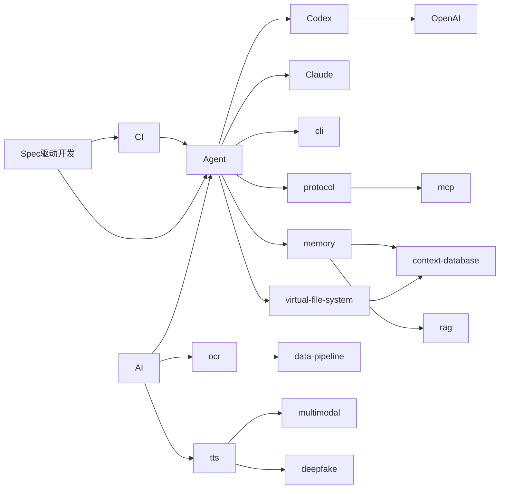

# 关系图谱

## 文档信息

- 类型：关系图谱
- 更新日期：2026-02-23

## 概览

## 相关词条

- [[00-元语/AI]]
- [[00-元语/Agent]]
- [[00-元语/cli]]
- [[00-元语/ocr]]
- [[00-元语/tts]]
- [[00-元语/protocol]]
- [[00-元语/mcp]]
- [[00-元语/virtual-file-system]]
- [[00-元语/context-database]]
- [[00-元语/memory]]
- [[00-元语/rag]]
- [[00-元语/data-pipeline]]
- [[00-元语/multimodal]]
- [[00-元语/deepfake]]
- [[00-元语/Codex]]
- [[00-元语/Claude]]
- [[00-元语/OpenAI]]
- [[00-元语/Spec驱动开发]]
- [[00-元语/CI]]

## 关联主题

- [[00-元语/AI]]
- [[00-元语/Agent]]
- [[00-元语/meta]]
- [[00-元语/wiki]]
- [[00-元语/workflow]]
- [[00-元语/skills]]
- [[00-元语/knowledge-graph]]
- [[00-元语/知识图谱]]
- [[00-元语/memory]]
