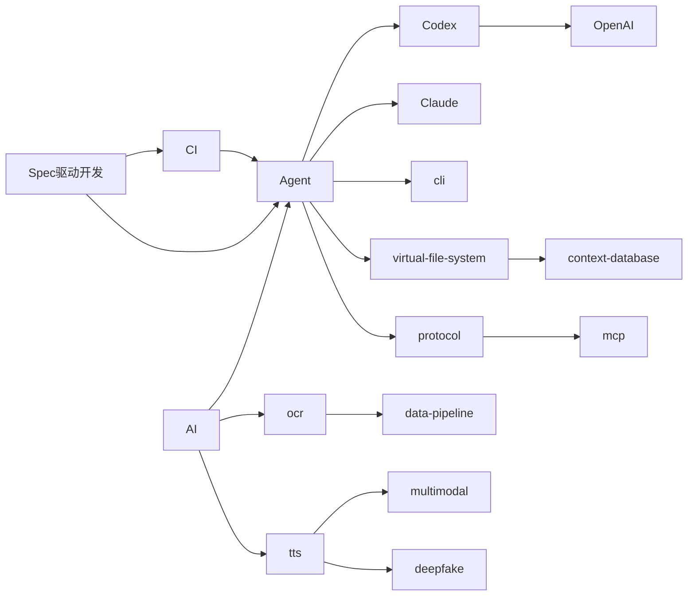

# 关系图谱

## 文档信息

- 类型：关系图谱
- 更新日期：2026-02-22

## 概览

## 相关词条

- [[AI]]
- [[Agent]]
- [[cli]]
- [[ocr]]
- [[tts]]
- [[protocol]]
- [[virtual-file-system]]
- [[Codex]]
- [[Claude]]
- [[OpenAI]]
- [[Spec驱动开发]]
- [[CI]]

## 相关文档

## 关联主题

- [[00-元语/AI]]
- [[00-元语/Agent]]
- [[00-元语/meta]]
- [[00-元语/wiki]]
- [[00-元语/knowledge-graph]]
- [[00-元语/知识图谱]]
