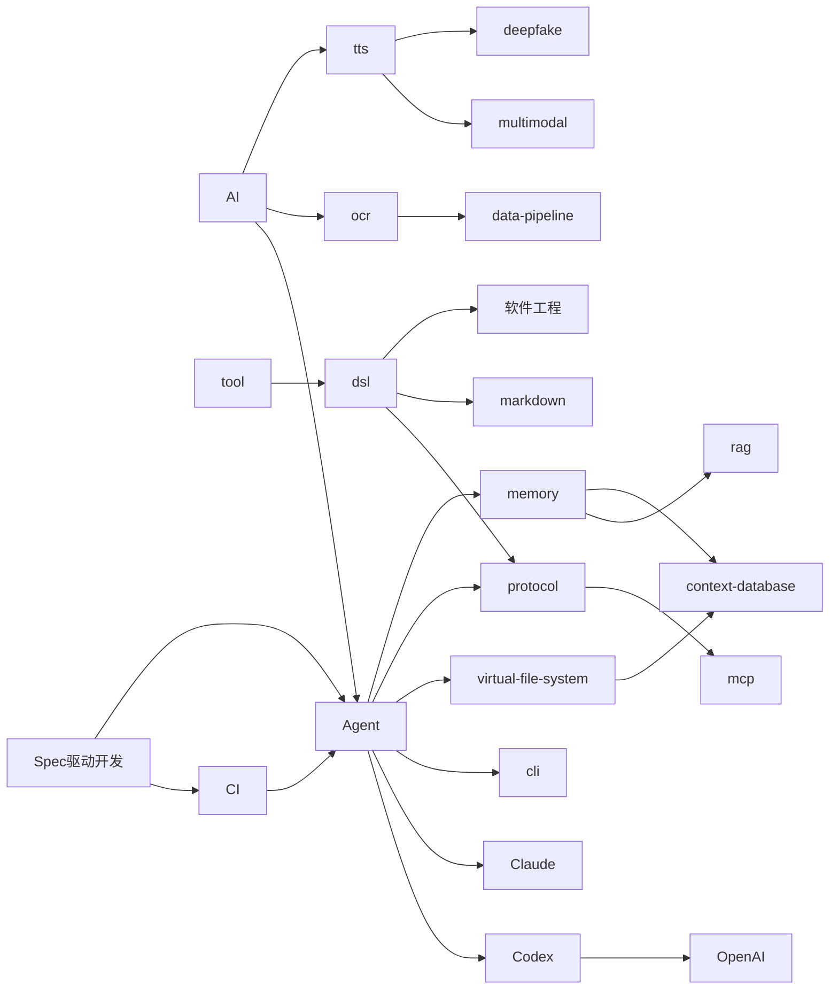

## 定义

关系图谱用于展示仓库内核心元语之间的导航关系，帮助读者从一个概念快速跳到相邻概念。它服务于人工阅读、词条维护与知识组织，不是标签汇总页，也不等同于强调可计算关系与推理约束的知识图谱。

## 使用边界

- 只保留对当前仓库有解释价值的高置信度概念关系，不按关键词重合机械补链。
- 图中的连线用于表达“适合一起理解”的结构关系，不承担严格实体建模或机器推理语义。
- 新增或重构元语词条后，应回到此页人工更新关键连接，避免关系图谱与实际词条体系脱节。

## 概览

```mermaid
graph LR
  AI[AI] --> Agent[Agent]
  AI --> OCR[ocr]
  AI --> TTS[tts]
  Agent --> Codex[Codex]
  Agent --> Claude[Claude]
  Agent --> CLI[cli]
  Agent --> VFS[virtual-file-system]
  Agent --> Protocol[protocol]
  Agent --> Memory[memory]
  Tool[tool] --> DSL[dsl]
  DSL --> Protocol
  DSL --> Markdown[markdown]
  DSL --> SWE[软件工程]
  Protocol --> MCP[mcp]
  VFS --> ContextDB[context-database]
  Memory --> RAG[rag]
  Memory --> ContextDB
  OCR --> Pipeline[data-pipeline]
  TTS --> Multi[multimodal]
  TTS --> Risk[deepfake]
  Codex --> OpenAI[OpenAI]
  Spec[Spec驱动开发] --> CI[CI]
  Spec --> Agent
  CI --> Agent
```

## 相关词条

- [[00-元语/AI]]
- [[00-元语/Agent]]
- [[00-元语/tool]]
- [[00-元语/dsl]]
- [[00-元语/cli]]
- [[00-元语/markdown]]
- [[00-元语/软件工程]]
- [[00-元语/ocr]]
- [[00-元语/tts]]
- [[00-元语/protocol]]
- [[00-元语/mcp]]
- [[00-元语/virtual-file-system]]
- [[00-元语/context-database]]
- [[00-元语/memory]]
- [[00-元语/rag]]
- [[00-元语/data-pipeline]]
- [[00-元语/multimodal]]
- [[00-元语/deepfake]]
- [[00-元语/Codex]]
- [[00-元语/Claude]]
- [[00-元语/OpenAI]]
- [[00-元语/Spec驱动开发]]
- [[00-元语/CI]]

## 相关文档

- [[00-元语/README|00-元语：关系图谱入口]]；关联理由：解说；说明：该页说明了关系图谱在元语目录中的入口定位，以及补词条后回写图谱的维护顺序。
- [[00-元语/meta|meta]]；关联理由：上下游；说明：meta 负责约束元语命名与维护规则，而本页把这些规则落实为可浏览的概念连接。
- [[00-元语/wiki|wiki]]；关联理由：上下游；说明：wiki 定义页面互链的组织方式，而本页把其中关键节点与跳转关系集中呈现出来。
- [[00-元语/知识图谱|知识图谱]]；关联理由：延伸思考；说明：该词条专门区分可计算的知识图谱与仓库内的文档关系图谱，有助于明确本页的边界。

## 关联主题

- [[00-元语/AI]]
- [[00-元语/Agent]]
- [[00-元语/tool]]
- [[00-元语/dsl]]
- [[00-元语/meta]]
- [[00-元语/wiki]]
- [[00-元语/knowledge-graph]]
- [[00-元语/知识图谱]]
