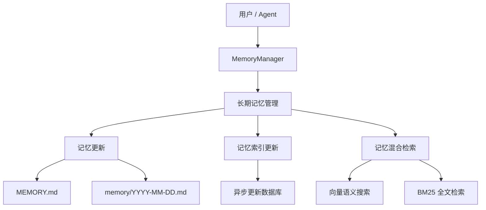
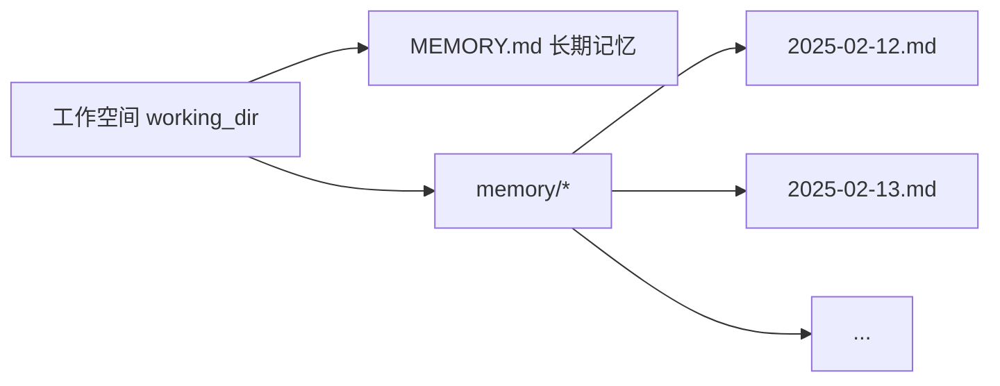
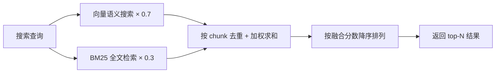

## 摘要

### 1) 一句话总结
CoPaw 的长期记忆机制通过将关键信息持久化到 Markdown 文件，并结合向量检索与关键词检索的混合召回，实现跨对话的上下文保存与按需找回。

### 2) 核心要点
* **文件化存储**：记忆以纯 Markdown 格式保存，分为长期记忆 `MEMORY.md` 与每日日志 `memory/YYYY-MM-DD.md`。
* **工具直接读写**：Agent 通过 `read`、`write`、`edit` 等文件工具直接操作记忆文件，文件本身就是真实数据源。
* **异步索引更新**：系统通过 `watchfile` 监控文件变化，异步刷新本地数据库中的语义与向量索引。
* **双重找回机制**：既可以用 `memory_search` 做按意图模糊召回，也可以在已知路径时直接读取具体记忆文件。
* **混合检索架构**：文档描述为向量搜索权重 `0.7` 与 BM25 / 关键词检索权重 `0.3` 的融合召回，通过扩候选、独立打分、去重合并和排序截断返回结果。
* **Embedding 与后端可配置**：向量检索依赖 `EMBEDDING_API_KEY` 与 `EMBEDDING_MODEL_NAME`，存储后端支持 `local`、`chroma`、`sqlite` 与 `auto`。

### 3) 风险与不足
* **后端兼容性约束**：文档明确提到 `chroma` 在部分 Windows 环境下可能出现 core dump，`sqlite` 在 macOS 14 及更低版本上存在卡死和闪退问题。
* **单一检索存在盲区**：向量搜索不擅长精确、高信号 token，关键词检索又不擅长语义改写，因此需要混合检索互补。
* **关键词路径说明较简化**：文档将该路径描述为 BM25 全文检索，但给出的示例打分公式更接近基于命中词比例与短语加分的简化评分逻辑。

## 正文

长期记忆让 CoPaw 具备跨对话的持久记忆能力：它通过文件工具把关键信息写入 Markdown 文件长期保存，并配合语义检索随时召回。官方文档说明，这套机制受 [OpenClaw](https://github.com/openclaw/openclaw) 启发，并由 [ReMe](https://github.com/agentscope-ai/ReMe) 实现。

## 架构概览



长期记忆管理包含以下能力：

| 能力 | 说明 |
| --- | --- |
| **记忆持久化** | 通过文件工具（`read` / `write` / `edit`）将关键信息写入 Markdown 文件，文件即真实数据源 |
| **文件监控** | 通过 `watchfile` 监控文件改动，异步更新本地数据库中的语义索引与向量索引 |
| **语义搜索** | 通过向量嵌入与 BM25 混合检索，按语义召回相关记忆 |
| **文件读取** | 直接通过文件工具读取对应的 Memory Markdown 文件，按需加载以保持上下文精简 |

## 记忆文件结构

记忆采用纯 Markdown 文件存储，Agent 通过文件工具直接操作。默认工作空间使用两层结构：



### MEMORY.md

存放长期有效、极少变动的关键信息。

- **位置**：`{working_dir}/MEMORY.md`
- **用途**：存储决策、偏好、持久性事实
- **更新方式**：Agent 通过 `write` / `edit` 文件工具写入

### memory/YYYY-MM-DD.md

每天一页，追加写入，记录当天的工作与交互。

- **位置**：`{working_dir}/memory/YYYY-MM-DD.md`
- **用途**：记录日常笔记和运行上下文
- **更新方式**：Agent 通过 `write` / `edit` 文件工具追加写入；当对话过长需要总结时也会自动触发

### 何时写入记忆

| 信息类型 | 写入目标 | 操作方式 | 示例 |
| --- | --- | --- | --- |
| 决策、偏好、持久事实 | `MEMORY.md` | `write` / `edit` 工具 | “项目使用 Python 3.12”、“偏好 pytest 框架” |
| 日常笔记、运行上下文 | `memory/YYYY-MM-DD.md` | `write` / `edit` 工具 | “今天修复了登录 Bug”、“部署了 v2.1” |
| 用户明确要求记忆 | 立即写入文件 | `write` 工具 | “记住这个”一类指令不应只停留在内存中 |

## 记忆配置

### Embedding 配置

以下环境变量用于配置 Embedding 参数，从而支持语义向量搜索：

| 环境变量 | 说明 | 默认值 |
| --- | --- | --- |
| `EMBEDDING_API_KEY` | Embedding 服务的 API Key | `` |
| `EMBEDDING_BASE_URL` | Embedding 服务的 URL | `https://dashscope.aliyuncs.com/compatible-mode/v1` |
| `EMBEDDING_MODEL_NAME` | Embedding 模型名称 | `` |
| `EMBEDDING_DIMENSIONS` | 向量维度，用于初始化向量数据库 | `1024` |
| `EMBEDDING_CACHE_ENABLED` | 是否启用 Embedding 缓存 | `true` |
| `EMBEDDING_MAX_CACHE_SIZE` | Embedding 缓存最大条目数 | `2000` |
| `EMBEDDING_MAX_INPUT_LENGTH` | 单次 Embedding 最大输入长度 | `8192` |
| `EMBEDDING_MAX_BATCH_SIZE` | Embedding 批处理最大数量 | `10` |

只有 `EMBEDDING_API_KEY` 和 `EMBEDDING_MODEL_NAME` 同时非空时，系统才会开启多路检索中的向量检索。

### 底层数据库

通过 `MEMORY_STORE_BACKEND` 环境变量配置记忆存储后端：

| 环境变量 | 说明 | 默认值 |
| --- | --- | --- |
| `MEMORY_STORE_BACKEND` | 记忆存储后端，可选 `auto`、`local`、`chroma`、`sqlite` | `auto` |

存储后端说明如下：

| 后端 | 说明 |
| --- | --- |
| `auto` | 自动选择：Windows 使用 `local`，其他系统使用 `chroma` |
| `local` | 本地文件存储，无需额外依赖，兼容性最好 |
| `chroma` | Chroma 向量数据库，支持高效向量检索；在某些 Windows 环境下可能出现 core dump |
| `sqlite` | SQLite 数据库加向量扩展；在 macOS 14 及更低版本上存在卡死和闪退问题 |

官方建议优先使用默认的 `auto` 模式，由系统根据平台自动选择最稳定的后端。

## 搜索记忆

Agent 有两种方式找回过去的记忆：

| 方式 | 工具 | 适用场景 | 示例 |
| --- | --- | --- | --- |
| 语义搜索 | `memory_search` | 不确定记在哪个文件，按意图模糊召回 | “之前关于部署流程的讨论” |
| 直接读取 | `read_file` | 已知具体日期或文件路径，精确查阅 | 读取 `memory/2025-02-13.md` |

## 混合检索原理

记忆搜索默认采用向量与 BM25 的混合检索，两条召回路径各有所长，互为补充。

### 向量语义搜索

系统会把文本映射到高维向量空间，通过余弦相似度衡量语义距离，因此能捕捉措辞不同但含义相近的内容：

| 查询 | 能召回的记忆 | 为什么能命中 |
| --- | --- | --- |
| “项目的数据库选型” | “最终决定用 PostgreSQL 替换 MySQL” | 语义相关：都在讨论数据库技术选择 |
| “怎么减少不必要的重建” | “配置了增量编译避免全量构建” | 语义等价：减少重建接近增量编译 |
| “上次讨论的性能问题” | “P99 延迟从 800ms 优化到 200ms” | 语义关联：性能问题对应延迟优化 |

文档同时指出，向量搜索对精确、高信号 token 的表现较弱，因为嵌入模型更擅长捕捉整体语义，而不是单个 token 的精确匹配。

### BM25 全文检索

文档将另一条路径描述为 BM25 全文检索，它主要用于子串与精确 token 命中：

| 查询 | BM25 能命中 | BM25 会漏掉 |
| --- | --- | --- |
| `handleWebSocketReconnect` | 包含该函数名的记忆片段 | “WebSocket 断线重连的处理逻辑” |
| `ECONNREFUSED` | 包含该错误码的日志记录 | “数据库连接被拒绝” |

文档给出的示例打分逻辑如下：

```text
base_score = 命中词数 / 查询总词数           # 范围 [0, 1]
phrase_bonus = 0.2（仅当多词查询且完整短语匹配时）
score = min(1.0, base_score + phrase_bonus)  # 上限 1.0
```

例如查询 “数据库 连接 超时” 时，如果一段文本只包含 “数据库” 和 “超时”，则 `base_score = 2/3 ≈ 0.67`，没有完整短语加分，最终 `score = 0.67`。

文档还提到，为了解决 ChromaDB `$contains` 查询的大小写敏感问题，系统会自动生成每个词的多种大小写变体，以提升召回率。

### 混合检索融合

系统会把向量与 BM25 两路结果做加权融合，默认向量权重为 `0.7`，BM25 权重为 `0.3`：

1. 扩大候选池：将目标结果数乘以 `candidate_multiplier`，两路分别检索更多候选。
2. 独立打分：向量与 BM25 各自返回带分数的候选列表。
3. 加权合并：按 `path + start_line + end_line` 去重后合并。
4. 排序截断：按融合后的 `final_score` 降序排列，返回 top-N 结果。

示例查询 “handleWebSocketReconnect 断线重连” 时：

| 记忆片段 | 向量分数 | BM25 分数 | 融合分数 | 排序 |
| --- | --- | --- | --- | --- |
| `handleWebSocketReconnect` 函数负责 WebSocket 断线重连 | 0.85 | 1.0 | `0.85×0.7 + 1.0×0.3 = 0.895` | 1 |
| 网络断开后自动重试连接的逻辑 | 0.78 | 0.0 | `0.78×0.7 = 0.546` | 2 |
| 修复了 `handleWebSocketReconnect` 的空指针异常 | 0.40 | 0.5 | `0.40×0.7 + 0.5×0.3 = 0.430` | 3 |



这套设计的重点是让自然语言提问与精确关键词查找都能得到可用结果，而不是依赖单一路径。

## 相关页面

- [项目介绍](https://copaw.agentscope.io/docs/intro/)：说明 CoPaw 的整体定位与适用场景。
- [控制台](https://copaw.agentscope.io/docs/console/)：介绍如何在控制台中管理记忆与配置。
- [Skills](https://copaw.agentscope.io/docs/skills/)：说明内置能力与自定义扩展方式。
- [配置与工作目录](https://copaw.agentscope.io/docs/config/)：补充工作目录、配置文件和运行方式。

## 相关文档

- [[01-博客/Manthan Gupta/Clawdbot 如何记住一切：本地持久记忆系统解析|Clawdbot 如何记住一切：本地持久记忆系统解析]]；关联理由：观点一致；说明：两文都把 Markdown 文件视为长期记忆的真实数据源，并强调写回与检索的配合。
- [[01-博客/LangChain/我们是如何构建 Agent Builder 记忆系统的|我们是如何构建 Agent Builder 记忆系统的]]；关联理由：解说；说明：该文补充了另一套 Agent 记忆系统的工程实现，便于对比 CoPaw 的分层记忆与混合检索设计。

## 关联主题

- [[00-元语/memory]]
- [[00-元语/Agent]]
- [[00-元语/rag]]
- [[00-元语/context-database]]
- [[00-元语/markdown]]
- [[00-元语/llm]]
